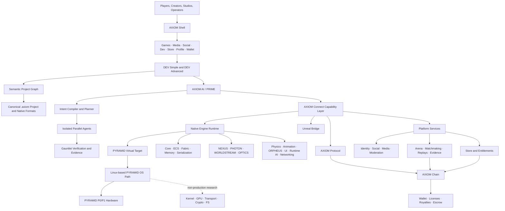
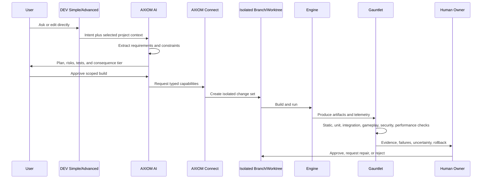

# AXIOM-XIII System Map

**Status:** Derived architecture map. The [master specification](../source/AXIOM-XIII-V1-Master-Specification.md) remains authoritative.

## Architectural thesis

AXIOM-XIII should be implemented as a set of explicit domains connected through versioned schemas, authenticated events, and capability-controlled interfaces. It must not become a distributed monolith held together by shared database tables, ambient credentials, or AI agents with unrestricted filesystem and network access.

## Layer model

The system should be reasoned about in layers. Lower layers define stable contracts and constraints; higher layers compose them into user-visible capabilities. A higher layer must not bypass a lower layer’s security or lifecycle controls merely for implementation convenience.

| Layer | Responsibilities | Forbidden coupling |
|---|---|---|
| Governance | Requirements, ADRs, code ownership, licensing, threat models, release gates | Unowned critical code or undocumented decisions |
| Canonical data | IDs, schemas, `.axiom`, native formats, migrations, provenance | Opaque source-of-truth caches or unstable identifiers |
| Capability plane | AXIOM Connect, permission broker, audit events, API versioning | Ambient authority, direct secret access, undocumented calls |
| Runtime foundation | Platform abstraction, ECS, FABRIC, memory, reflection, serialization, build identity | Permanent exposure of replaceable vendor types |
| Engine systems | Rendering, world streaming, physics, animation, audio, UI, runtime AI, networking | Background AI/chain work destabilizing foreground frame time |
| Development intelligence | Ask/Plan/Build, planner, agents, model router, memory, Gauntlet | Direct writes to protected branches, signing, wallets, or release state |
| Platform services | Identity, social, media, projects, Store, entitlements, payments, telemetry, moderation | Direct cross-domain database access |
| Economic and competitive | Chain, Wallet, Arena, marketplace, prize escrow, match evidence | Blockchain in the moment-to-moment gameplay loop |
| Device path | Virtual Target, Linux OS image, controller, firmware, hardware | Experimental kernel/driver/crypto becoming production dependencies without gates |

## Control plane and data plane

AXIOM-XIII requires a strict distinction between control decisions and real-time data flow. Control-plane failures should degrade optional features without preventing offline play or corrupting a running game. Data-plane performance must remain protected from background AI, chain, telemetry, and service workloads.

| Plane | Examples | Availability expectation |
|---|---|---|
| Foreground real-time data plane | Frame simulation, rendering, input, audio, gameplay networking | Highest priority; bounded latency and resource use |
| Authoring data plane | Asset import, cooking, shader compile, project indexing | Interruptible and resumable; must preserve canonical source |
| Platform data plane | Media, social, Store catalog, cloud projects, game servers | Independently scalable and failure-isolated |
| Economic data plane | Wallet signing, chain state, entitlement reconciliation, prize settlement | Strong consistency where value moves; explicit degraded modes |
| Development control plane | Plans, capabilities, approvals, agent budgets, branch operations | Audited and reversible where possible |
| Release control plane | Certification, signing, artifact promotion, rollout, rollback | Isolated keys and named human authorization |
| Policy control plane | Region, operator, age, sanctions, risk and feature policy | Deterministic, versioned, and explainable decisions |

## Canonical project flow

Ask is read-only. Plan may create a proposed task graph and acceptance strategy but does not implement. Build may act only inside explicit permissions, budgets, branches, and consequence tiers. This state model should be enforced in code rather than treated as a user-interface convention.

## Domain dependency graph

| Domain | Hard dependencies | Should not depend on |
|---|---|---|
| Shell | Identity interface, install registry, input/UI abstraction | Chain availability for boot or ordinary offline play |
| `.axiom` project | Stable IDs, schema registry, migration framework | Proprietary binary-only caches |
| AXIOM AI | Project graph, Connect capabilities, branches, tests, evidence schema | One model provider or an external orchestration product at runtime |
| Unreal Bridge | Legal/provenance scan, parser corpus, `.axiom`, AXIR/Flow mappings, Gauntlet | Unreal runtime or silent unsupported conversion |
| Engine | Platform abstraction, ECS, FABRIC, memory, formats, build system | Direct service databases, wallet keys, production signing |
| Renderer | Frame graph, memory budgets, asset pipeline, WORLDSTREAM, profiler | Unbounded streaming or undocumented hardware assumptions |
| Services | Protocol schemas, identity, events, policy, observability | Cross-domain shared tables |
| Store | Entitlements, payments/ledger, certification, signing, policy | Synchronous chain requirement for each game launch |
| Chain | Consensus, state model, established cryptography, audits, operations | Unreviewed primitives or moment-to-moment gameplay authority |
| Wallet | Identity boundaries, key separation, secure signing UI, recovery | Untrusted game UI controlling confirmation |
| Arena | Matchmaking, server authority, replays, anti-cheat, policy, escrow | Undocumented pay-to-win effects or unsupported regional exposure |
| PYRAMID OS | Virtual Target, signed image, secure boot, A/B updates | Experimental kernel as a V1 production dependency |

## Repository segmentation

The monorepo provides coordination and shared visibility during the foundational phase. Some systems should be moved to separately permissioned repositories or restricted subtrees when implementation begins because access to one domain must not imply access to all high-sensitivity internals.

| Restricted area | Reason for stronger isolation |
|---|---|
| Production signing and release keys | Compromise enables malicious official artifacts |
| Wallet custody and recovery | Compromise can cause direct financial loss |
| Validator and chain operational secrets | Compromise can damage consensus and settlement integrity |
| Anti-cheat detection and fraud ranking | Disclosure weakens defensive effectiveness |
| Secure boot, firmware, and device keys | Compromise undermines the hardware trust chain |
| Proprietary model weights and private evaluation corpora | High-value IP and potential sensitive training data |
| Legal identity and regulated records | Privacy and compliance obligations |

Segmentation does not mean duplicating schemas. Shared public contracts should remain versioned in the monorepo, while secrets and sensitive implementations are granted through least privilege.

## Initial interfaces to define

| Interface | Minimum v0 content |
|---|---|
| AXIOM ID | Namespace, type, version, generation rules, serialization, collision behavior |
| `.axiom` manifest | Project identity, schema version, modules, targets, dependencies, permissions, provenance, build profiles |
| Schema Registry | Type definitions, compatibility, migrations, ownership, security class, deprecation status |
| AXIOM Connect capability | Capability ID, subject, resource, action, scope, expiry, budget, approval, audit correlation |
| Change set | Requirement links, branch, actor, inputs, outputs, diffs, tests, evidence, rollback |
| Build identity | Commit, project hash, toolchain, dependency lock, target, signer, SBOM, timestamp |
| Package manifest | Publisher, version, dependencies, capabilities, native-code status, licenses, provenance, security review |
| Match evidence | Build identity, server authority, participants, inputs/events, replay hash, anti-cheat signals, signatures |
| Digital object | Identity, issuer, rights/license, provenance, state, transfer constraints, linked content hash |
| Policy decision | Operator, region, user attributes, feature, rule version, decision, reason, appeal route |

## Architecture invariants

The following invariants should be encoded in tests and CI wherever possible.

| Invariant | Verification approach |
|---|---|
| Canonical project state survives cache loss | Delete indexes/caches and rebuild the project graph from source |
| Simple and Advanced share one project | Cross-mode edit and round-trip tests with no export/conversion step |
| AI cannot exceed its capability grant | Negative permission tests and audit-log assertions |
| Third-party implementations do not leak into public AXIOM APIs | API surface scans and boundary tests |
| Offline single-player play is not blocked by service or chain outage | Failure-injection launch tests |
| Builds are attributable and reproducible | Rebuild comparison with lockfile, SBOM, and artifact attestations |
| Secure wallet confirmation cannot be replaced by game UI | UI trust-boundary and clickjacking-style tests |
| Experimental components cannot carry production value | Build configuration and deployment-policy checks |
| Cross-domain storage is mediated by APIs/events | Static architecture tests and service ownership rules |
| Every accepted build has evidence | CI blocks promotion when the Gauntlet evidence bundle is absent |

## Recommended first executable slice

The first executable should be deliberately narrow: a controller-navigable shell with the seven locked tabs; local GAMES and DEV sandboxes; a text-readable `.axiom` sample; a minimal native runtime that renders one scene and responds to input; Simple and Advanced shells pointing to the same project; a local AXIOM Connect capability; Ask/Plan/Build stubs that cannot exceed an isolated worktree; and Gauntlet checks that produce a signed development evidence bundle.

This slice proves the defining architecture without pretending that the Store, Wallet, Chain, Arena, Unreal conversion, AAA renderer, custom OS, or hardware are production-ready.
